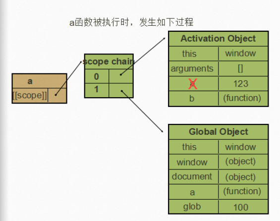
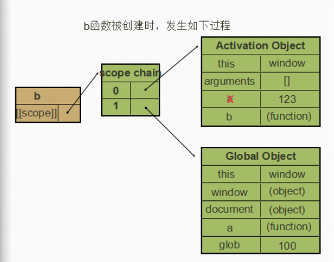
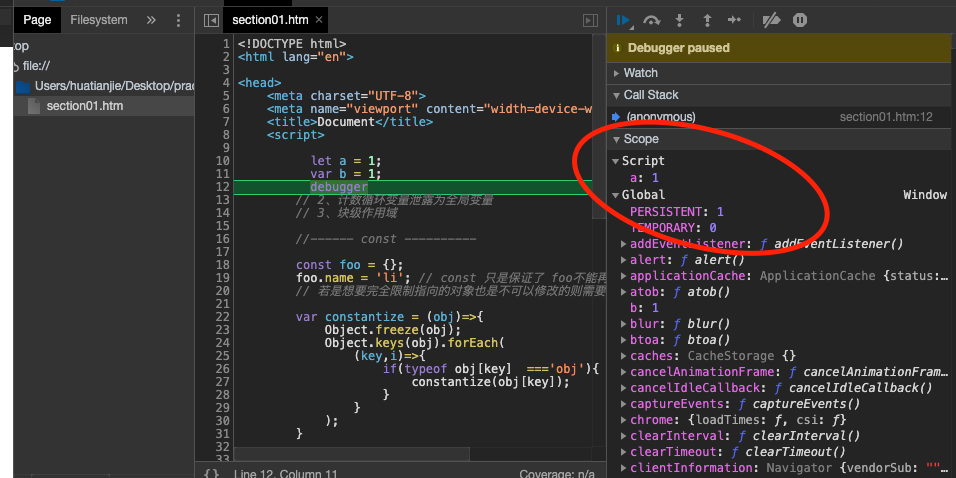

# 变量、作用域与内存

## 1、原始值与引用值

> 原始值就是最简单的数据，主要包含：Undefined、Null、Boolean、Number、String和Symbol；
>
> 引用值是由多个值组成的对象；

#### 1.1 动态属性

```javascript
// (1)引用类型可以添加属性
let person = new Object();
person.name = 'yi';
console.log(person.name);

// (2) 基本类型不能添加属性
let name = 'zheng';
name.age = 18;
console.log(name.age);// undefined
```

#### 1.2 复制值

```javascript
// (1) 基本类型: 赋值之后之后互不相干
let num1 = 5；
let num2 = num1;
num2 = 100;
console.log(num1,num2);// 5,100

// (2)引用类型: 两个指针指向内存的同一块区域
let obj1 = {};
let obj2 = obj1;
obj.name = 'zheng';
console.log(obj1.name,obj2.name);// 'zheng' 'zheng'
```

#### 1.2 传递参数

```javascript
//(1) 函数的形参传递是值传递；
function addTen(num){
  num += 10;
  return num;
}
let count = 20;
let result = addTen(count);
console.log(count); // 20
console.log(result); // 30

//(2) 函数参数是引用类型也是值传递；
function setName(obj){
  obj.name = 'li';
  // 指针指向另外的区域
  obj = new Object();
  obj.name = 'wang';
}
let person = new Object();
setName(person);
console.log(person.name);// 'li'
```

#### 

## 2、执行上下文与作用域

> 函数与变量的上下文决定了它们可以访问哪些数据，以及它们可以调用的函数(方法);
>
> 每个上下文中都有一个关联对象，而这个上下文中定义的所有变量和函数都存在与这个对象上；
>
> 上下文的代码在执行的时候，会创建关联对象的作用域链，这个作用域链决定各级上下文中的代码访问变量和函数的顺序；

#### 2.1 全局作用域

> 全局对象的作用域，任意地方都可以访问到（如果没有被函数作用域覆盖）

```JavaScript
// 全局变量:挂载到window对象上
 var i = 0;
 // 定义外部函数 ： 挂载到window对象上
 function outer(){
     console.log(i); // 0：获取的是全局变量window.i
     // 定义一个内部函数
     function inner(){
       // 隐式在此处有： var i；的提升声明
         console.log(i); // undefined: 先在i所处的函数作用域中找是否有i的其他声明,由于函数作用域中存在i的其他声明，因此会把 var i；提前，声明未赋值所以值为undefined
         var i = 1;
         console.log(i); // 1 ：在函数作用域执行完毕，函数作用域中的i会被清理
     }
     inner();
     console.log(i);// 0 ： 获取的是window.i
 }
 outer();
 console.log(i);// 0
```

#### 2.2 函数作用域

```javascript
//函数作用域
function test(){
    var i = 0;
    console.log(i); // 出了函数作用域后，i就被销毁了
}

console.log(i);// Uncaught ReferenceError: i is not defined
```

#### 2.3 [[Scopes]] 属性

> + 每个javascript函数都是一个对象，对象中有些属性我们可以访问，但有些不可以；不可以访问的属性仅供javascript引擎存取，[[Scopes]]就是其中一个;[[Scopes]]指的就是我们所说的作用域,其中存储了运行期上下文的集合。即作用域决定了代码区块中变量和其他资源的可见性。
> + 当函数执行时，会创建一个称为执行期上下文的内部对象。一个执行期上下文定义了一个函数执行时的环境，函数每次执行时对应的执行上下文都是独一无二的，所以多次调用一个函数会导致创建多个执行上下文，当函数执行完毕，执行上下文被销毁
> + 在函数中查找变量，从其作用域链的顶端依次向下查找，从Scope chain 的0位依次查到最后一位。

 

#### 2.4 示例

```javascript
function a() {
    function b() {
        var y = 234;
        x = 0;
    }
    var x = 123;
    b();  // 执行该函数将x的值给修改了；
    console.log(x); // 0
  }
var glob = 100;
a();
```

##### 2.4.1 a函数定义

> a()函数定义,其scope中存放Global Object


##### 2.4.2 a函数执行

> a函数执行时，形成作用域链，Scope chain[0] 存放Activation Object， Scope chain[1] 存放Global Object



##### 2.4.3 b函数定义

> b函数定义，因为它是a函数内部的函数，因此其执行期上下文与a函数执行时是一样的；



##### 2.4.4 b函数执行

> b函数执行时，产生自己的AO，在作用域链中将a函数的AO与GO储存位置下移，第0位存自己的AO


##### 2.4.5 最终

> b函数 Scope chain 储存的a函数的AO与a()中的AO一样，只是将其引用挂到里面，即通过b()中可以改变a()中变量的值

#### 2.5 顶层对象

> [ES2020](https://github.com/tc39/proposal-global) 在语言标准的层面，引入`globalThis`作为顶层对象。也就是说，任何环境下，`globalThis`都是存在的，都可以从它拿到顶层对象，指向全局环境下的`this`。

```javascript
var b = 1;
// 如果在 Node 的 REPL 环境，可以写成 global.a
// 或者采用通用方法，写成 this.a
window.b // 1

let a = 1;
window.a // undefined ; 挂载在全局scope的script下，见下图：
```

 

## 3、垃圾回收

> 垃圾回收：JavaScript是执行环境负责在代码执行时负责管理内存；

#### 3.1 标记清理法

> 当变量进入执行上下文进行标记，当变量出上下文也进行标记清除；
>
> 随后垃圾回收程序会做一次内存清理，回收内存；

#### 3.2 引用计数

> 对每个值都记录它被引用的次数，引用次数为0时，就会被清理