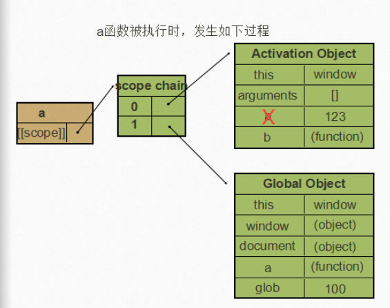

# ES6 (一)

[ES6入门](https://es6.ruanyifeng.com/#README)

## 1、变量
### 1.1 var的问题

> var 声明的变量存在以下问题：

```javascript
// 1 可以重复声明
var a = 12;
var a = 5;
// 2 无法限制修改，没有常量概念
var x = 4;
x = 5;
// 3 没有块级作用域 ：条件语句、循环语句等都不构成作用域
{
  var y = 0; 
}
console.log(y);// 0
```
> ES5中JavaScript只有以下两种作用域

+ 全局作用域 

  > 全局对象的作用域，任意地方都可以访问到（如果没有被函数作用域覆盖）,下述【代码第9行】的位置i变量就被函数作用域覆盖了；

  ```JavaScript
  // 全局变量:挂载到window对象上
   var i = 0;
   // 定义外部函数 ： 挂载到window对象上
   function outer(){
       console.log(i); // 0：获取的是全局变量window.i
       // 定义一个内部函数
       function inner(){
         // 隐式在此处有： var i；
           console.log(i); // undefined: 先在i所处的函数作用域中找是否有i的其他声明,由于函数作用域中存在i的其他声明，因此会把 var i；提前，声明未赋值所以值为undefined
           var i = 1;
           console.log(i); // 1 ：在函数作用域执行完毕，函数作用域中的i会被清理
       }
       inner();
       console.log(i);// 0 ： 获取的是window.i
   }
   outer();
   console.log(i);// 0
  ```

+ 函数作用域

  ```javascript
  //函数作用域
  function test(){
      var i = 0;
      console.log(i); // 出了函数作用域后，i就被销毁了
  }
  
  console.log(i);// Uncaught ReferenceError: i is not defined
  ```

+ 变量提升 [场景1]

  ```javascript
  var tmp = new Date();
  function func() {
      // var tmp；会被隐式提升到这里
      console.log("1===>" + tmp); // undefined
      if (false) {
          var tmp = "hello"; // var tmp；声明会被提升；流程控制语句的{},不算作用域 【不存在块级作用域】
      }
      console.log('2===>' + tmp); // undefined : if判断为false，未执行tmp的赋值
  }
  func();
  ```

  + 变量提升 [场景2]

    1. [[scope]]:每个javascript函数都是一个对象，对象中有些属性我们可以访问，但有些不可以；不可以访问的属性仅供javascript引擎存取，[[scope]]就是其中一个。[[scope]]指的就是我们所说的作用域,其中存储了运行期上下文的集合。即作用域决定了代码区块中变量和其他资源的可见性。

       

    2. 当函数执行时，会创建一个称为执行期上下文的内部对象。一个执行期上下文定义了一个函数执行时的环境，函数每次执行时对应的执行上下文都是独一无二的，所以多次调用一个函数会导致创建多个执行上下文，当函数执行完毕，执行上下文被销毁

    3. 在函数中查找变量，从其作用域链的顶端依次向下查找，从Scope chain 的0位依次查到最后一位。

    ```javascript
    function a() {
        function b() {
            var y = 234;
            x = 0;
        }
        var x = 123;
        b();  // 执行该函数将x的值给修改了；
        console.log(x); // 0
      }
    var glob = 100;
    a();
    ```

    1. a()函数定义，其scope中存放Global Object

       

       

    2. a()执行时，形成作用域链，Scope chain[0] 存放Activation Object， Scope chain[1] 存放Global Object

       

       

    3. b()定义，因为它是a()内部的函数，因此其执行期上下文与a()执行时是一样的；

       

       
    
    4. b()执行时，产生自己的AO，在作用域链中将a()的AO与GO储存位置下移，第0位存自己的AO
    
       
    
       
    
    5. 最终：b() Scope chain 储存的a() 的AO与a()中的AO一样，只是将其引用挂到里面，即通过b()中可以改变a()中变量的值

###  1.2 let与const

```javascript
/*
  let  :  不能重复声明；变量-可以修改；块级作用域
  const:  不能重复声明；常量-不可以修改；块级作用域
*/
 // 1、let声明的变量超出块级作用域就无效
{
  let a = 10;
  var b = 1;
}
 a;// a is not defined
 b; // 1
// 2、 对于for循环就适合使用let
for(let i = 0; i < 10; i++){
 // ---
}
console.log(i); // ReferenceError : i is not defined

// 3 : 循环变量与内部变量也不是在一个作用域
for (let i = 0; i < 3; i++) {
  let i = 'abc';
  console.log(i);
}
// abc
// abc
// abc

```
```JavaScript
// 4、let解决for循环闭包问题
var a = [];
for(var i = 0; i < 10 ; i++){
  a[i] = function(){
    console.log(i);
  };
}
a[6](); // 10: 闭包持有的i是全局的，导致每次循环i的值都会变化，最终数组中存储的i都为10

// 修改成以下方式就能解决：每次循环都是创建一个新的i变量，对于循环计数JavaScript引擎有记录
var a = [];
for (let i = 0; i < 10; i++) {
  a[i] = function () {
    console.log(i);
  };
}
a[6](); // 6
```

### 1.3 为什么需要块级作用域？

> 1、内层变量可能会覆盖外层变量
>
> ```javascript
> var tmp = new Date();
> 
> function f() {
>   console.log(tmp);
>   if (false) {
>     var tmp = 'hello world';
>   }
> }
> 
> f(); // undefined
> ```
>
> 2、计数的循环变量泄露为全局变量
>
> ```javascript
> var s = 'hello';
> 
> for (var i = 0; i < s.length; i++) {
>   console.log(s[i]);
> }
> 
> console.log(i); // 5
> ```
>
> 

```javascript
// IIFE 匿名立即执行函数,封装一个局部变量
(function(){
  var temp = '';
})();
// 块级作用域写法
{
  let tmp = '';
}
```
### 1.4 const
> 常量`foo`储存的是一个地址，这个地址指向一个对象。不可变的只是这个地址，即不能把`foo`指向另一个地址，但对象本身是可变的，所以依然可以为其添加新属性

```javascript
const foo = {};

// 为 foo 添加一个属性，可以成功
foo.prop = 123;
foo.prop // 123

// 将 foo 指向另一个对象，就会报错
foo = {}; // TypeError: "foo" is read-only

// 如果真想冻结对象不可以修改
const foo = Object.freeze({});
// 常规模式时，下面一行不起作用；
// 严格模式时，该行会报错
foo.prop = 123;
```
### 1.5 顶层对象
> [ES2020](https://github.com/tc39/proposal-global) 在语言标准的层面，引入`globalThis`作为顶层对象。也就是说，任何环境下，`globalThis`都是存在的，都可以从它拿到顶层对象，指向全局环境下的`this`。

```javascript
var b = 1;
// 如果在 Node 的 REPL 环境，可以写成 global.a
// 或者采用通用方法，写成 this.a
window.b // 1

let a = 1;
window.a // undefined ; 挂载在全局scope的script下，见下图：
```


### 1.6 变量的解构赋值

```JavaScript
// 1、数组的解构赋值
let [a,b,c] = [1,2,3];
// 2、对象的解构赋值
let {foo,bar} = {foo:'aa',bar:'bb'}
// 3、foo是匹配的模式，baz才是变量。真正被赋值的是变量baz，而不是模式foo。
let { foo: baz } = { foo: 'aaa', bar: 'bbb' };
baz // "aaa"
foo // error: foo is not defined
// 4 、 对象的解构也可以指定默认值
var {x = 3} = {}; // x = 3

```

> 解构赋值的主要用途：

```javascript
// 1 : 交换变量的值
let x = 1;
let y = 2;
[x,y] = [y,x];
// 2 : 从函数返回多个值
function example() {
  return {
    foo: 1,
    bar: 2
  };
}
let { foo, bar } = example();
// 3 : 函数参数定义
// 参数是一组有次序的值
function f([x, y, z]) { ... }
f([1, 2, 3]);

// 参数是一组无次序的值
function f({x, y, z}) { ... }
f({z: 3, y: 2, x: 1});
// 4 ： 提取JSON的数据
let jsonData = {
  id: 42,
  status: "OK",
  data: [867, 5309]
};

let { id, status, data: number } = jsonData;
// 5 : 函数参数的默认值
 jQuery.ajax = function (url, {
  async = true,
  beforeSend = function () {},
  cache = true,
  complete = function () {},
  crossDomain = false,
  global = true,
  // ... more config
} = {}) {
  // ... do stuff
};
// 6: 输入模块的指定方法
const { SourceMapConsumer, SourceNode } = require("source-map");
```

### 1.7 字符串

```javascript
// 1： 遍历字符串
for(let codePoint of 'foo'){
  console.log(codePoint)
}
// 2：模板字符串 :使用 反引号（``），同时支持插入变量 
$('#result').append(`
  There are <b>${basket.count}</b> items
   in your basket, <em>${basket.onSale}</em>
  are on sale!
`);
// 3:  模板编译【待补充】

// 4: 实例方法：includes(), startsWith(), endsWith() 
let s = 'Hello world!';
//使用第二个参数n时，endsWith的行为与其他两个方法有所不同。它针对前n个字符，而其他两个方法针对从第n个位置直到字符串结
s.startsWith('world', 6) // true
s.endsWith('Hello', 5) // true
s.includes('Hello', 6) // false
// 5: 实例方法：repeat()  
'x'.repeat(3) // "xxx"
// 6: 实例方法：padStart()：头部补全，padEnd()：尾部补全
'x'.padStart(5, 'ab') // 'ababx'
'x'.padStart(4, 'ab') // 'abax'
// 7: 

```


## 2、函数
### 2.1 箭头函数
```javascript
/*
  1、如果只有一个参数，()可以省略
  2、如果只有一个return,可以省略{}
*/
function foo(){
  alert('abc');
}

let foo = ()=>{
  alert('abc');
};

let arr =[12,5,8,99,44,34];
arr.sort((n1,n2)=>{
 return n1 - n2;
});
// 省略写法
arr.sort((n1,n2)=> n1 - n2);
```
### 2.2 函数参数
#### 2.2.1 参数的扩展/展开
```javascript
/*
  参数扩展： rest parameter
  1、收集剩余参数：参数必须放在函数参数末尾
  2、展开数组； ...arr 
*/

function show(a,b,...args){
  alert(a);
  alert(b);
  alert(args);
}
show(12,15,8,9,34);


// 例子
function show(...args){
   fn(...args);
}
function fn(a,b){
  alert(a+b);
}
show(12,5);

```
#### 2.2.2 默认参数
```javascript
function show(a,b=15){
  alert(a);
  alert(b);
}
show(10);
```
### 2.3 this指针问题

#### 2.3.1 普通函数的this指针

```javascript
// 情况1：
function foo(){
  console.log(this); // foo是window对象上的有一个函数，因此this指向window
}
foo();

// 情况2：
function foo(){
  console.log(this); // foo是obj对象上的一个函数，因此this指向obj;
}
var obj = {
  foo:foo
}
obj.foo();

```

#### 2.3.2 普通函数的setTimeout：this指针

```javascript
// 情况1：
function foo(){
     console.log(this); // 函数的调用者是window，this指向window
     setTimeout(function(){
        console.log(this); // 函数的调用者是window，this指向window
     }, 100);
}
foo();

// 情况2：
function foo(){
  console.log(this); // 函数的调用者是obj，this指向obj
   setTimeout(function(){
        console.log(this); // 函数的调用者是window，this指向window
    }, 100);
}
var obj = {
  foo:foo
}
obj.foo();

```

#### 2.3.3 箭头函数的setTimeout：this指针

> 箭头函数可以让`setTimeout`里面的`this`，绑定定义时所在的作用域，而不是指向运行时所在的作用域;

```javascript
// 情况1：
function foo(){
     console.log(this); // 函数的调用者是window，this指向window
     setTimeout(()=>{
        console.log(this); // 箭头函数定义时绑定的是window，因此this指向window
     }, 100);
}
foo();

// 情况2：
function foo(){
  console.log(this); // 函数的调用者是obj，this指向obj
  // (1)let that = this;
   setTimeout(()=>{
     // (2) console.log(that);
        console.log(this); // 箭头函数定义时绑定的是obj，因此this指向obj
    }, 100);
}
var obj = {
  foo:foo
}
obj.foo();

```

> `Timer`函数内部设置了两个定时器，分别使用了箭头函数和普通函数。前者的`this`绑定定义时所在的作用域（即`Timer`函数），后者的`this`指向运行时所在的作用域（即全局对象）。所以，3100 毫秒之后，`timer.s1`被更新了 3 次，而`timer.s2`一次都没更新

```javascript
function Timer() {
  this.s1 = 0;
  this.s2 = 0;
  // 箭头函数
  setInterval(() => this.s1++, 1000);
  // 普通函数
  setInterval(function () {
    this.s2++;
  }, 1000);
}

var timer = new Timer();

setTimeout(() => console.log('s1: ', timer.s1), 3100);
setTimeout(() => console.log('s2: ', timer.s2), 3100);
// s1: 3
// s2: 0
```

#### 2.3.4  箭头函数可以让`this`指向固定化，这种特性很有利于封装回调函数

> 下面代码的`init`方法中，使用了箭头函数，这导致这个箭头函数里面的`this`，总是指向`handler`对象。否则，回调函数运行时，`this.doSomething`这一行会报错，因为此时`this`指向`document`对象。

```javascript
var handler = {
  id: '123456',

  init: function() {
    document.addEventListener('click',
      // 当前this指向handler
      event => this.doSomething(event.type), false);
  },

  doSomething: function(type) {
    console.log('Handling ' + type  + ' for ' + this.id);
  }
};

```


#### 2.3.5 箭头函数中根本没有自己的this

> 下面代码的`init`方法中，使用了箭头函数，这导致这个箭头函数里面的`this`，总是指向`handler`对象。否则，回调函数运行时，`this.doSomething`这一行会报错，因为此时`this`指向`document`对象。

```javascript
// ES6
function foo() {
  setTimeout(() => {
    console.log('id:', this.id);
  }, 100);
}

// ES5
function foo() {
  var _this = this;
  setTimeout(function () {
    console.log('id:', _this.id);
  }, 100);
}
// 转换后的 ES5 版本清楚地说明了，箭头函数里面根本没有自己的this，而是引用外层的this。
```

#### 2.3.6  请问下面的代码之中有几个`this`？

> 下面代码之中，只有一个`this`，就是函数`foo`的`this`，所以`t1`、`t2`、`t3`都输出同样的结果。因为所有的内层函数都是箭头函数，都没有自己的`this`，它们的`this`其实都是最外层`foo`函数的`this`。

```javascript
function foo() {
  return () => {
    return () => {
      return () => {
        console.log('id:', this.id);
      };
    };
  };
}

var f = foo.call({id: 1});

var t1 = f.call({id: 2})()(); // id: 1
var t2 = f().call({id: 3})(); // id: 1
var t3 = f()().call({id: 4}); // id: 1
```

#### 2.3.7  不适合使用箭头函数

> 由于箭头函数使得`this`从“动态”变成“静态”，下面两个场合不应该使用箭头函数。

```javascript
// 第一个场合是定义对象的方法，且该方法内部包括this,因为对象不构成单独的作用域，导致jumps箭头函数定义时的作用域就是全局作用域。
const cat = {
  lives: 9,
  jumps: () => {
    this.lives--;
  }
}

// 第二个场合是需要动态this的时候，也不应使用箭头函数。
var button = document.getElementById('press');
button.addEventListener('click', () => {
  this.classList.toggle('on'); // 此时this指向了window
});
```

#### 2.3.8  嵌套的箭头函数

```javascript
// 普通函数的写法
function insert(value) {
  return {into: function (array) {
    return {after: function (afterValue) {
      array.splice(array.indexOf(afterValue) + 1, 0, value);
      return array;
    }};
  }};
}

insert(2).into([1, 3]).after(1); //[1, 2, 3]

// 使用箭头函数
let insert = (value) => ({into: (array) => ({after: (afterValue) => {
  array.splice(array.indexOf(afterValue) + 1, 0, value);
  return array;
}})});

insert(2).into([1, 3]).after(1); //[1, 2, 3]
```

### 2.4 尾递归

> 函数调用自身，称为递归。如果尾调用自身，就称为尾递归。

```javascript
// 递归
function factorial(n) {
  if (n === 1) return 1;
  return n * factorial(n - 1);
}

factorial(5) // 120

// 尾递归
function factorial(n, total) {
  if (n === 1) return total;
  return factorial(n - 1, n * total);
}

factorial(5, 1) // 120


// 斐波那契数列
function Fibonacci (n) {
  if ( n <= 1 ) {return 1};

  return Fibonacci(n - 1) + Fibonacci(n - 2);
}

Fibonacci(10) // 89
Fibonacci(100) // 超时
Fibonacci(500) // 超时

// 使用尾递归优化斐波那契数列
function Fibonacci2 (n , ac1 = 1 , ac2 = 1) {
  if( n <= 1 ) {return ac2};

  return Fibonacci2 (n - 1, ac2, ac1 + ac2);
}

Fibonacci2(100) // 573147844013817200000
Fibonacci2(1000) // 7.0330367711422765e+208
Fibonacci2(10000) // Infinity
```

## 3.数组

### 3.1扩展运算符

> 扩展运算符

```javascript
// 将数组变成参数序列
console.log(...[1,2,3]);// 1,2,3

function push(array,...items){
  array.push(...items)
}
```

#### 3.1.1  替换函数的apply方法

> 

```javascript
// ES5 的写法
function f(x, y, z) {
  // ...
}
var args = [0, 1, 2];
f.apply(null, args);

// ES6的写法
function f(x, y, z) {
  // ...
}
let args = [0, 1, 2];
f(...args);

// ES5 的写法
Math.max.apply(null, [14, 3, 77])

// ES6 的写法
Math.max(...[14, 3, 77])

// 等同于
Math.max(14, 3, 77);


```

#### 3.1.2 扩展运算符的应用

```javascript
// (1) --  复制数组 --
const a1 = [1,2]
const a2 = a1;
a2[0] = 2;
a1;// [2,2] ; a2并未深拷贝a1，只是a1，a2指针指向的是同一个内存地址，所以修改a2的值，a1也会发生变化

// ES5中通过以下方式进行深拷贝
const a1 = [1,2];
const a2 = a1.concat(); 
a2[0] = 2;
a1;// [1,2] ; 
// ES6中通过以下方式进行深拷贝
const a1 = [1,2];
const a2 = [...a1]; // 创建了一个新的数组a2


// (2) --  合并数组 -- 【以下两种方式都是浅拷贝，新数组中的元素都是对原数组的引用】
const arr1 = ['a', 'b'];
const arr2 = ['c'];
const arr3 = ['d', 'e'];

// ES5 的合并数组
arr1.concat(arr2, arr3);
// [ 'a', 'b', 'c', 'd', 'e' ]

// ES6 的合并数组
[...arr1, ...arr2, ...arr3]
// [ 'a', 'b', 'c', 'd', 'e' ]
```

### 3.2 数组方法

#### 3.2.1  Array.from

```javascript
// Array.from方法用于将两类对象转为真正的数组
let arrayLike = {
    '0': 'a',
    '1': 'b',
    '2': 'c',
    length: 3
};

// ES5的写法
var arr1 = [].slice.call(arrayLike); // ['a', 'b', 'c']

// ES6的写法
let arr2 = Array.from(arrayLike); // ['a', 'b', 'c']


// NodeList对象
let ps = document.querySelectorAll('p');
Array.from(ps).filter(p => {
  return p.textContent.length > 100;
});

// arguments对象
function foo() {
  var args = Array.from(arguments);
  // ...
}

```

#### 3.2.2  Array.of

```javascript
// Array.of方法用于将一组值，转换为数组。Array.of基本上可以用来替代Array()或new Array()，并且不存在由于参数不同而导致的重载
Array.of(3, 11, 8) // [3,11,8]
Array.of(3) // [3]
Array.of(3).length // 1

```

#### 3.2.3 find()和findIndex()

```javascript
// 下面代码中，find方法的回调函数可以接受三个参数，依次为当前的值、当前的位置和原数组。
[1, 5, 10, 15].find(function(value, index, arr) {
  return value > 9;
}) // 10

// findIndex() 返回符合条件的第一个成员的位置，如没有则返回：-1
```

#### 3.2.4 fill 

```javascript
// 用给定的值填充数组
['a', 'b', 'c'].fill(7)
// [7, 7, 7]

new Array(3).fill(7)
// [7, 7, 7]
```

#### 3.2.5  数组实例的 entries()，keys() 和 values() 

```javascript
for (let index of ['a', 'b'].keys()) {
  console.log(index);
}
// 0
// 1

for (let elem of ['a', 'b'].values()) {
  console.log(elem);
}
// 'a'
// 'b'

for (let [index, elem] of ['a', 'b'].entries()) {
  console.log(index, elem);
}
// 0 "a"
// 1 "b"
```

#### 3.2.6 数组实例的 includes()

```javascript
[1, 2, 3].includes(2)     // true
[1, 2, 3].includes(4)     // false
[1, 2, NaN].includes(NaN) // true
```

#### 3.2.7  数组实例的 flat()，flatMap()

```javascript
[1, 2, [3, [4, 5]]].flat()
// [1, 2, 3, [4, 5]]

[1, 2, [3, [4, 5]]].flat(2)
// [1, 2, 3, 4, 5]
```

#### 3.2.8  数组空位

> 数组的空位指，数组的某一个位置没有任何值。比如，`Array`构造函数返回的数组都是空位。

```javascript
//  空位不是undefined，一个位置的值等于undefined，依然是有值的。空位是没有任何值，in运算符可以说明这一点。
0 in [undefined, undefined, undefined] // true
0 in [, , ,] // false
```

## 4、对象

#### 4.1属性的简洁表示法

```javascript
// （1） 创建对象使用简洁语法
let birth = '2000/01/01';

const Person = {

  name: '张三',

  //等同于birth: birth
  birth,

  // 等同于hello: function ()...
  hello() { console.log('我的名字是', this.name); }

};

// (2) 属性的setter和getter也是采用简洁语法
const cart = {
  _wheels: 4,

  get wheels () {
    return this._wheels;
  },

  set wheels (value) {
    if (value < this._wheels) {
      throw new Error('数值太小了！');
    }
    this._wheels = value;
  }
}

// (3) 简写的对象方法不能用作构造函数，会报错。
const obj = {
  f() {
    this.foo = 'bar';
  }
};

new obj.f() // 报错
```

#### 4.2 属性的可枚举性和遍历

> 对象的每个属性都有一个描述对象（Descriptor），用来控制该属性的行为。`Object.getOwnPropertyDescriptor`方法可以获取该属性的描述对象。

```javascript
let obj = { foo: 123 };
Object.getOwnPropertyDescriptor(obj, 'foo')
//  {
//    value: 123,
//    writable: true,
//    enumerable: true,
//    configurable: true
//  }
```

> 属性的遍历有以下5种方式

```javascript
（1）for...in

for...in循环遍历对象自身的和继承的可枚举属性（不含 Symbol 属性）。

（2）Object.keys(obj)

Object.keys返回一个数组，包括对象自身的（不含继承的）所有可枚举属性（不含 Symbol 属性）的键名。

（3）Object.getOwnPropertyNames(obj)

Object.getOwnPropertyNames返回一个数组，包含对象自身的所有属性（不含 Symbol 属性，但是包括不可枚举属性）的键名。

（4）Object.getOwnPropertySymbols(obj)

Object.getOwnPropertySymbols返回一个数组，包含对象自身的所有 Symbol 属性的键名。

（5）Reflect.ownKeys(obj)

Reflect.ownKeys返回一个数组，包含对象自身的（不含继承的）所有键名，不管键名是 Symbol 或字符串，也不管是否可枚举。
```

#### 4.3 super

> `this`关键字总是指向函数所在的当前对象，ES6 又新增了另一个类似的关键字`super`，指向当前对象的原型对象。

```javascript
const proto = {
  foo: 'hello'
};

const obj = {
  foo: 'world',
  find() {
    return super.foo; // super 指向当前对象的原型对象
  }
};

Object.setPrototypeOf(obj, proto);
obj.find() // "hello"
```

> JavaScript 引擎内部，`super.foo`等同于`Object.getPrototypeOf(this).foo`（属性）或`Object.getPrototypeOf(this).foo.call(this)`（方法）。

```javascript
const proto = {
  x: 'hello',
  foo() {
    console.log(this.x);
  },
};

const obj = {
  x: 'world',
  foo() {
    super.foo(); // Object.getPrototypeOf(this).foo.call(this) 当前的this指向为obj
  }
}

Object.setPrototypeOf(obj, proto);

obj.foo() // "world" : super.foo指向原型对象proto的foo方法，但是绑定的this却还是当前对象obj，因此输出的就是world。
```

#### 4.4 对象的扩展运算符

```javascript
// (1) 解构赋值
let { x, y, ...z } = { x: 1, y: 2, a: 3, b: 4 };
x // 1
y // 2
z // { a: 3, b: 4 }

// (2) 解构赋值要求右侧是一个对象，如果是undefined或者是null则会报运行时错误
let { ...z } = null; // 运行时错误
let { ...z } = undefined; // 运行时错误

// (3) 解构赋值必须是最后一个参数
let { ...x, y, z } = someObject; // 句法错误
let { x, ...y, ...z } = someObject; // 句法错误
```

>  解构赋值的注意事项

```javascript
// (1) 解构赋值是浅拷贝
let obj = { a: { b: 1 } };
let { ...x } = obj;
obj.a.b = 2;
x.a.b // 2

// (2) 解构赋值不能继承原型对象上的属性
let o1 = { a: 1 };
let o2 = { b: 2 };
o2.__proto__ = o1;
let { ...o3 } = o2;
o3 // { b: 2 }
o3.a // undefined
```

#### 4.4 对象克隆的方法 【待验证】

> 包含克隆原型对象上的方法

```javascript
// 写法一 ： 部分浏览器可能不兼容
const clone1 = {
  __proto__: Object.getPrototypeOf(obj),
  ...obj
};

// 写法二
const clone2 = Object.assign(
  Object.create(Object.getPrototypeOf(obj)),
  obj
);

// 写法三
const clone3 = Object.create(
  Object.getPrototypeOf(obj),
  Object.getOwnPropertyDescriptors(obj)
)
```

#### 4.5 链判断运算符

> 实际编程中读取每一个对象的属性，往往要判断该对象是否存在

```javascript
// 错误的写法
const  firstName = message.body.user.firstName;

// 正确的写法
const firstName = (message
  && message.body
  && message.body.user
  && message.body.user.firstName) || 'default';

// 为了简化ES2020 引入了“链判断运算符”（optional chaining operator）?.，简化上面的写法。
const firstName = message?.body?.user?.firstName || 'default';
```

#### 4.6 Null判断运算符

> 读取对象属性的时候，如果某个属性的值是`null`或`undefined`，有时候需要为它们指定默认值。常见做法是通过`||`运算符指定默认值

```javascript
const headerText = response.settings.headerText || 'Hello, world!';
const animationDuration = response.settings.animationDuration || 300;
const showSplashScreen = response.settings.showSplashScreen || true;
// 上述写法的问题在于：属性的值如果为空字符串或false或0，默认值也会生效

// 为了解决这一问题：ES2020 引入了一个新的 Null 判断运算符??。它的行为类似||，但是只有运算符左侧的值为null或undefined时，才会返回右侧的值
const headerText = response.settings.headerText ?? 'Hello, world!';
const animationDuration = response.settings.animationDuration ?? 300;
const showSplashScreen = response.settings.showSplashScreen ?? true;
```

#### 4.6 Object.is()

> 用来比较两个值是否严格相等

```javascript
Object.is('foo', 'foo')// true
Object.is({}, {})// false

// === 的缺点
+0 === -0 //true
NaN === NaN // false

// 使用Object.is()进行修正
Object.is(+0, -0) // false
Object.is(NaN, NaN) // true

// 使用ES5 实现Object.is()
Object.defineProperty(Object, 'is', {
  value: function(x, y) {
    if (x === y) {
      // 针对+0 不等于 -0的情况
      return x !== 0 || 1 / x === 1 / y;
    }
    // 针对NaN的情况
    return x !== x && y !== y;
  },
  configurable: true,
  enumerable: false,
  writable: true
});
```

#### 4.6 Object.assign()

> `Object.assign()`方法用于对象的合并，将源对象（source）的所有可枚举属性，复制到目标对象（target）。

```javascript
//(1) 存在相同属性，后面的对象的属性对应的值会替换掉前者
const target = { a: 1, b: 1 };

const source1 = { b: 2, c: 2 };
const source2 = { c: 3 };

Object.assign(target, source1, source2);
target // {a:1, b:2, c:3}

// （2）第一个参数不能接收null或者undefined，如果接收的是基本类型会被强制转化为对象类型
Object.assign(undefined) // 报错
Object.assign(null) // 报错
typeof Object.assign(2) // "object"

// (3) 包装对象
Object(true) // {[[PrimitiveValue]]: true}
Object(10)  //  {[[PrimitiveValue]]: 10}
Object('abc') // {0: "a", 1: "b", 2: "c", length: 3, [[PrimitiveValue]]: "abc"}

// (4) 只能拷贝可枚举的属性
Object.assign({b: 'c'},
  Object.defineProperty({}, 'invisible', {
    enumerable: false,
    value: 'hello'
  })
)
// { b: 'c' }
```

##### 4.6.1 object.assign()使用的注意点

```javascript
 //(1) 执行的为浅拷贝，不是深拷贝，如果源对象的属性值为对象，那么目标对象拷贝的只是引用	
const obj1 = {a: {b: 1}};
const obj2 = Object.assign({}, obj1);

obj1.a.b = 2;
obj2.a.b // 2

// (2) 同名属性替换
const target = { a: { b: 'c', d: 'e' } }
const source = { a: { b: 'hello' } }
Object.assign(target, source)// { a: { b: 'hello' } }

// (3) 数组的处理：Object.assign()把数组视为属性名为 0、1、2 的对象，因此源数组的 0 号属性4覆盖了目标数组的 0 号属性1
Object.assign([1, 2, 3], [4, 5])// [4, 5, 3]

// (4) 取值函数 : source对象的foo属性是一个取值函数，Object.assign()不会复制这个取值函数，只会拿到值以后，将这个值复制过去
const source = {
  get foo() { return 1 }
};
const target = {};

Object.assign(target, source)// { foo: 1 }
```

##### 4.6.2  object.assign()的常见用途

```javascript
 //(1) 为对象增加属性
class Point {
  constructor(x, y) {
    Object.assign(this, {x, y});
  }
}

// (2)为对象增加方法
Object.assign(SomeClass.prototype, {
  someMethod(arg1, arg2) {
    ···
  },
  anotherMethod() {
    ···
  }
});

// 等同于下面的写法
SomeClass.prototype.someMethod = function (arg1, arg2) {
  ···
};
SomeClass.prototype.anotherMethod = function () {
  ···
};

// (3) - 1 克隆对象
function clone(origin) { // 仅仅克隆原始对象的值，不能可能继承链上的属性
  return Object.assign({}, origin);
}
//(3) - 2 如何实现继承链上的属性一起拷贝？？
function clone(origin) {
  // 1 ： 先拿到origin的原型对象
  let originProto = Object.getPrototypeOf(origin);
  // 2 : 创建一个obj对象它的原型对象为originProto
  let obj = Object.create(originProto)；
  // 3 ： 将origin对象上可枚举的属性浅拷贝到obj上
  return Object.assign(obj, origin);
}

// (4) 合并多个对象
const merge =(...sources) => Object.assign({}, ...sources);

// (5) 为属性指定默认值 [属性最好都是简单类型，不要使用对象类型]
const DEFAULTS = {
  logLevel: 0,
  outputFormat: 'html'
};

function processContent(options) {
  options = Object.assign({}, DEFAULTS, options);
  console.log(options);
  // ...
}
```

#### 4.7 Object.getOwnPropertyDescriptors()

> ES5 的`Object.getOwnPropertyDescriptor()`方法会返回某个对象属性的描述对象（descriptor）
>
> ES2017 引入了Object.getOwnPropertyDescriptors()`方法，返回指定对象所有自身属性（非继承属性）的描述对象。

```javascript
// (1) 基本使用 
const obj = {
  foo: 123,
  get bar() { return 'abc' }
};

Object.getOwnPropertyDescriptors(obj)
// { foo:
//    { value: 123,
//      writable: true,
//      enumerable: true,
//      configurable: true },
//   bar:
//    { get: [Function: get bar],
//      set: undefined,
//      enumerable: true,
//      configurable: true } }

// （2）自定义实现：getOwnPropertyDescriptors
function getOwnPropertyDescriptors(obj) {
  const result = {};
  for (let key of Reflect.ownKeys(obj)) {
    result[key] = Object.getOwnPropertyDescriptor(obj, key);
  }
  return result;
}
```

##### `4.7.1 Object.getOwnPropertyDescriptors()`也可以用来实现 Mixin（混入）模式

```javascript
let mix = (object) => ({
  with: (...mixins) => mixins.reduce(
    (c, mixin) => Object.create(
      c, Object.getOwnPropertyDescriptors(mixin)
    ), object)
});

// multiple mixins example
let a = {a: 'a'};
let b = {b: 'b'};
let c = {c: 'c'};
let d = mix(c).with(a, b);

d.c // "c"
d.b // "b"
d.a // "a"
```

#### 4.8 [--proto--]属性，Object.setPrototypeOf()，Object.getPrototypeOf()

```javascript
/*
  Object.setPrototypeOf()（写操作）、
  Object.getPrototypeOf()（读操作）、
  Object.create()（生成操作）代替。
*/

// （1）设置对象的原型对象
// 格式
Object.setPrototypeOf(object, prototype)

// 用法
const o = Object.setPrototypeOf({}, null);

// (2) 获取对象的原型对象
Object.getPrototypeOf(obj);

```

#### 4.9 Object.keys()，Object.values()，Object.entries()

```javascript

// （1）Object.keys()
var obj = { foo: 'bar', baz: 42 };
Object.keys(obj)
// ["foo", "baz"]

// 用法
const o = Object.setPrototypeOf({}, null);

// (2) Object.values()
const obj = { foo: 'bar', baz: 42 };
Object.values(obj)
// ["bar", 42]

// (3) Object.entries() 
const obj = { foo: 'bar', baz: 42 };
Object.entries(obj)
// [ ["foo", "bar"], ["baz", 42] ]

```

#### 4.10  Object.entries()和Object.fromEntries() 

```javascript
// (1) Object.entries()
const obj = { foo: 'bar', baz: 42 };
Object.entries(obj)
// [ ["foo", "bar"], ["baz", 42] ]

//(2) Object.fromEntries() 
Object.fromEntries([
  ['foo', 'bar'],
  ['baz', 42]
])
// { foo: "bar", baz: 42 }

// 具体用途
Object.fromEntries(new URLSearchParams('foo=bar&baz=qux'))
// { foo: "bar", baz: "qux" }

```


## 4、generator
> 可将函数分段返回；

#### 4.1 generator的基本使用
```javascript
function *show(){
  alert('a');
  yield;
  alert('b');
}

let genObj = show();
genObj.next();// 'a'
genObj.next();// 'b'
```
#### 4.2 yield的传参
```javascript
function *show(){
  alert('a');
  let a = yield;
  alert('b');
  alert(a);
}

let genObj = show();
genObj.next(5);
genObj.next(12); // alert最后的值是：12
```
#### 4.3 yield的返回值
```javascript
function *show(){
  alert('a');
  yield 12;
  alert('b');
}

let genObj = show();
let res1 = genObj.next();//  {value:12,done:flase}
let res2 = genObj.next();// //  {value:undefined,done:true}
```
#### 4.4 有业务逻辑判断的异步操作
```javascript
/*
  当遇到有业务逻辑的异步判断：B的执行依赖于A请求后的数据时；promise就会显得不合适
  此时使用generator就会简化很多
*/ 

runner(function *(){
  let userData = yield $.ajax({url:'',dataType:'json'});
  if(userData.isVIP){
   let userVIP = yield $.ajax({url:'',dataType:'json'});
  }else{
    let user = yield $.ajax({url:'',dataType:'json'});
  }
});
```

